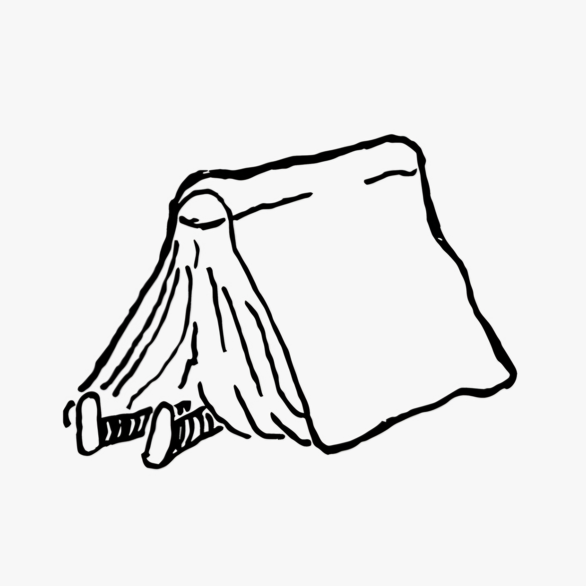

  

# GG-PUR: Guías Gratis para la Prueba Única de Residencias de Uruguay

Bienvenido a las **Guías Gratis para la Prueba Única de Residencias de Uruguay (GG-PUR)**. Este es un espacio para compartir resúmenes médicos 100% gratuitos para que los aspirantes cuenten con material de apoyo sin barreras económicas. 

> ⚠️ **IMPORTANTE:** 
Este proyecto es una iniciativa privada e independiente y no tiene una vinculación con ninguna institución u organización.

---

## ⚖️ Aviso Legal y Derechos de Autor

Las GG-PUR son gratis y están protegidas por derechos de autor. Queda **legalmente prohibida la apropiación, modificación, venta o lucro por parte de terceros** sobre el contenido aquí presentado.

Uno de los objetivos de este proyecto es eliminar la barrera económica, basándome en el principio de democratización de la información porque el conocimiento es un bien público. Toda la bibliografía utilizada es de libre acceso.

---

## 🛑 Disclaimer Médico y Académico

1. **Práctica Clínica:** Las GG-PUR son material de apoyo para estudio y **no deben usarse como guías de práctica clínica**. No asumo ningún tipo de responsabilidad por la implementación de lo aquí descrito en la práctica clínica ni por las eventuales complicaciones. Te recomiendo revisar la guía de práctica clínica oficial más actualizada y aceptada por Uruguay o el protocolo institucional para el tema en cuestión.
2. **Resultados Académicos:** La PUR es un sistema de evaluación dinámico donde es habitual que aparezcan preguntas sobre contenido fino. Debido a la naturaleza del examen, **no asumo ningún tipo de responsabilidad sobre tus resultados en el examen**.

---

## 📊 Estado del Contenido

Las guías en PDF están en proceso de confección, registro y revisión, por lo que se liberarán gradualmente y se actualizarán sistemáticamente. 

> 💡 **Fe de erratas:** Los resúmenes pueden tener errores de redacción, contenido u omisiones. En caso de identificarlos, te agradezco sugerirme los cambios mediante las *Issues* de este repositorio.

---

## 📂 Organización y Acceso al Contenido

Las GG-PUR estarán en formato PDF disponibles para su lectura digital, descarga e impresión (se recomienda el uso digital por los enlaces interactivos hacia contenido público como Medicina Legal).

A modo de economía cognitiva, organicé los temas de forma fluida:
* **Medicina Clínica de Adultos:** Unifica Medicina Familiar y Comunitaria, Medicina Interna y trastornos tiroideos clínicos/quirúrgicos. También se unifican temas comunes en las distintas asignaturas.
* **Estructura interna:** Verás mnemotecnias, tablas y esquemas propios. No se incluyen imágenes por copyright.
* **Referencias a PUR previas:** El número al final de una frase redirige a una nota al pie con el año, la idea central, opciones de descarte en negrita y la respuesta de la cátedra.

---

  <table border="0" cellpadding="0" cellspacing="0">
    <tr>
      <td bgcolor="green" style="padding: 10px 15px; border-top-left-radius: 6px; border-bottom-left-radius: 6px;">
        <b>DESCARGA PDF EN</b>
      </td>
      <td bgcolor="green" style="padding: 10px 15px; border-top-right-radius: 6px; border-bottom-right-radius: 6px;">
        <a href=https://drive.google.com/drive/folders/1fj6jlJPxJ5yftnsOMNTtgOi3xXrV68Qo" target="_blank" style="text-decoration: none;">
          <b>GOOGLE DRIVE 🚀</b>
        </a>
      </td>
    </tr>
  </table>

---

## ☕ Apoyo al proyecto

Si estas guías te resultaron útiles para preparar la PUR y deseas apoyar el tiempo dedicado a la creación de este contenido gratuito, puedes realizar una contribución voluntaria a través de Mercado Pago:

👉 **[Hacer una donación directa por Mercado Pago](https://link.mercadopago.com.uy/ggpur)**
---

## 💙 Mensaje para el Aspirante

Todos debemos tener en cuenta que la PUR evalúa conocimientos y rankea a los aspirantes. Al ser un examen dinámico, habrán preguntas en las que se fallará. ¿Qué marcará la diferencia? Tu dedicación, esfuerzo y estudio responsable.

**Te deseo el mejor resultado en el examen y que puedas acceder a esa especialidad que tanto te apasiona.**

¡Ahora sí, comencemos!
